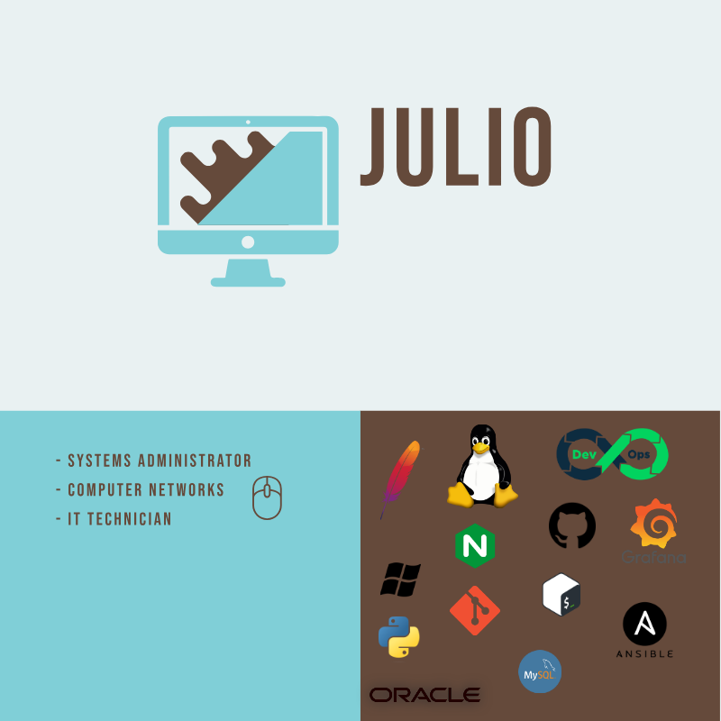

<h1 align="center">Hi, I'm Julio Jose 👨‍💻 </h1>

|   |   |
|---|---|
| **🔭 Currently Working On** | Systems Administration projects, applying DevOps practices to enhance collaboration between development and operations teams. |
| **🌱 Learning** | Continuously learning about specific technologies, with a particular emphasis on DevOps methodologies and tools. |
| **👯 Interested In Collaborating On** | Projects related to systems administration and the implementation of DevOps methodologies. |
| **🤔 Seeking Opportunities To** | Learn and contribute to innovative projects, especially those aiming to improve integration and continuous delivery. |
| **💬 Open To Discussions About** | Systems Administration, DevOps methodologies, fitness topics, and general computing. |
| **📫 Contact Me** | Via email: julio.josev7@gmail.com |
| **⚡ Fun Fact** | I never settle for the same thing for too long; I am always seeking new goals and challenges to achieve. |

|

    

<!--
**JJVT02/JJVT02** is a ✨ _special_ ✨ repository because its `README.md` (this file) appears on your GitHub profile.

Here are some ideas to get you started:

- 🔭 I’m currently working on ...
- 🌱 I’m currently learning ...
- 👯 I’m looking to collaborate on ...
- 🤔 I’m looking for help with ...
- 💬 Ask me about ...
- 📫 How to reach me: ...
- 😄 Pronouns: ...
- ⚡ Fun fact: ...
-->
